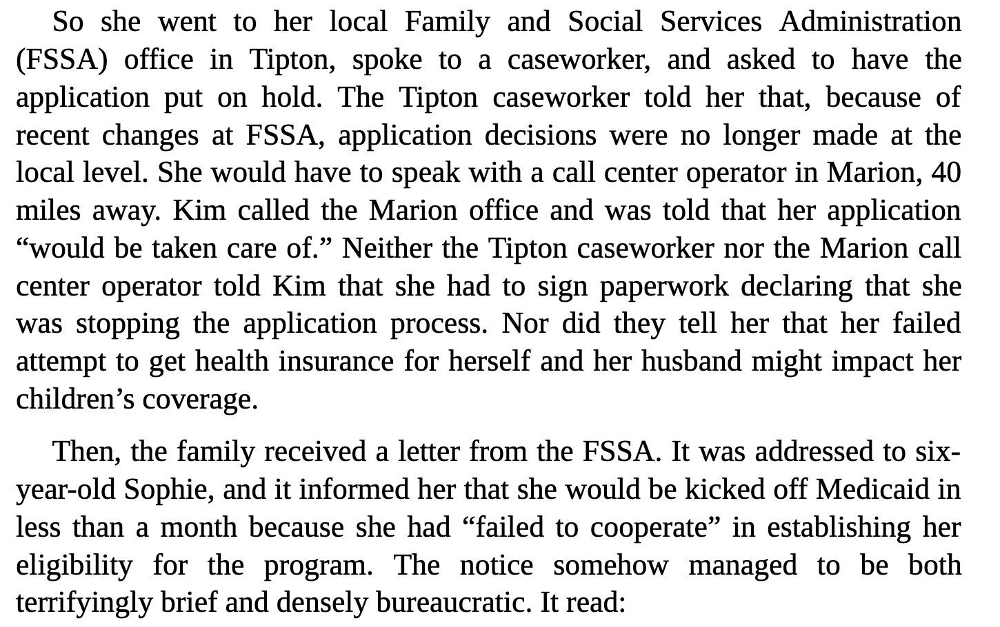
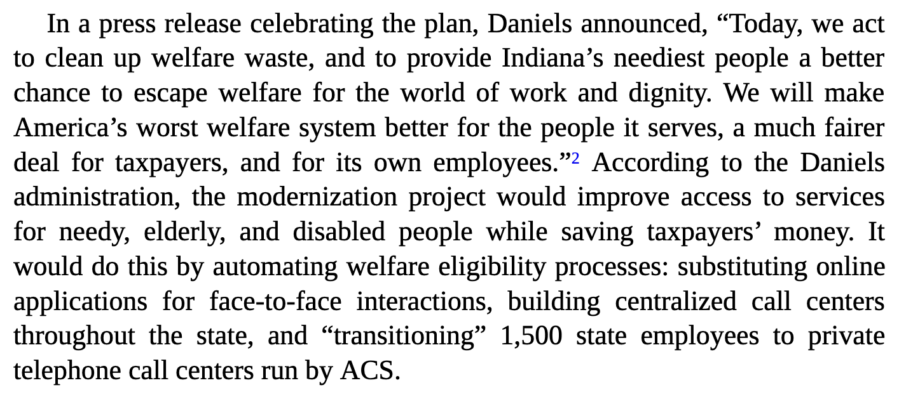
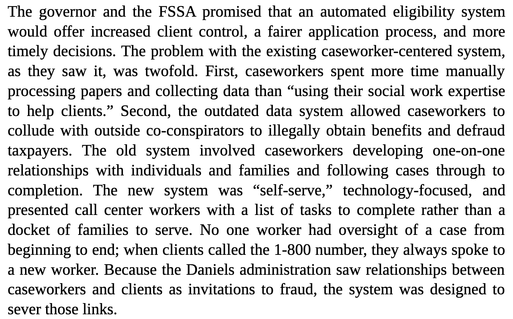
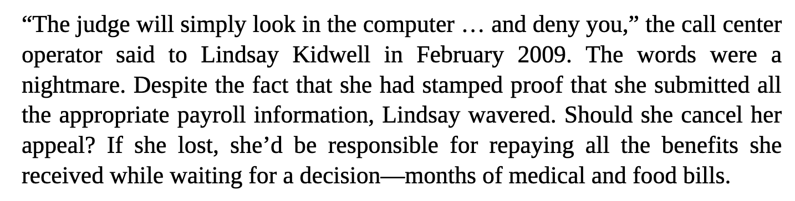
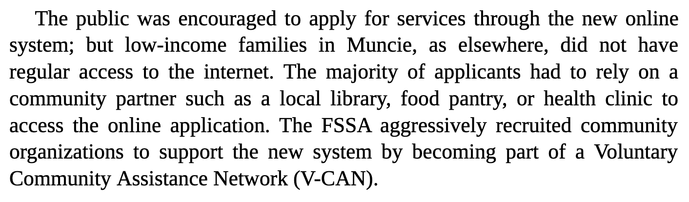
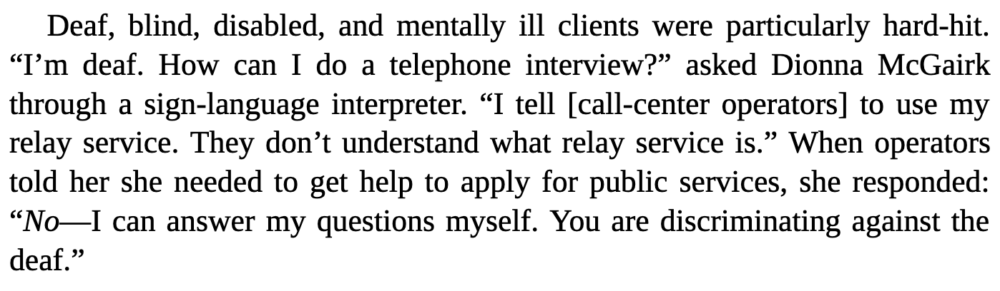
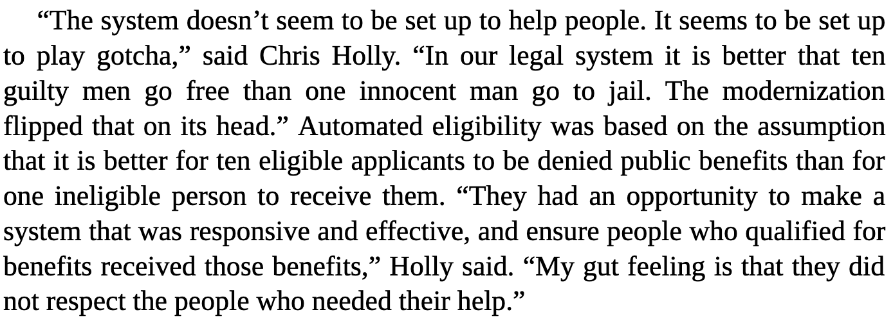
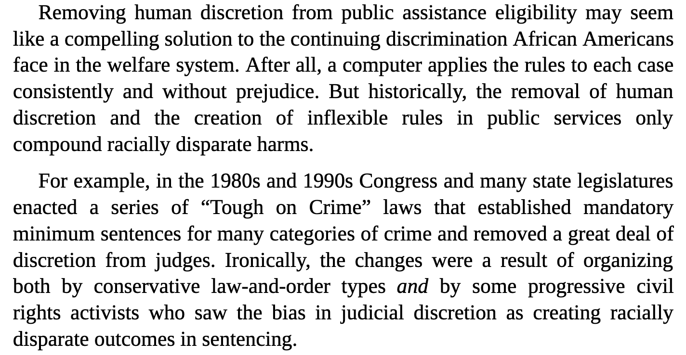

## Class Ten: Digital Discourse

### Review of Assigned Media + New Media (40 minutes)

For each quote, we plan on discussing it, placing it into its context, and understanding how it fits into the broader discussion about bias.

__Automating Inequality__

